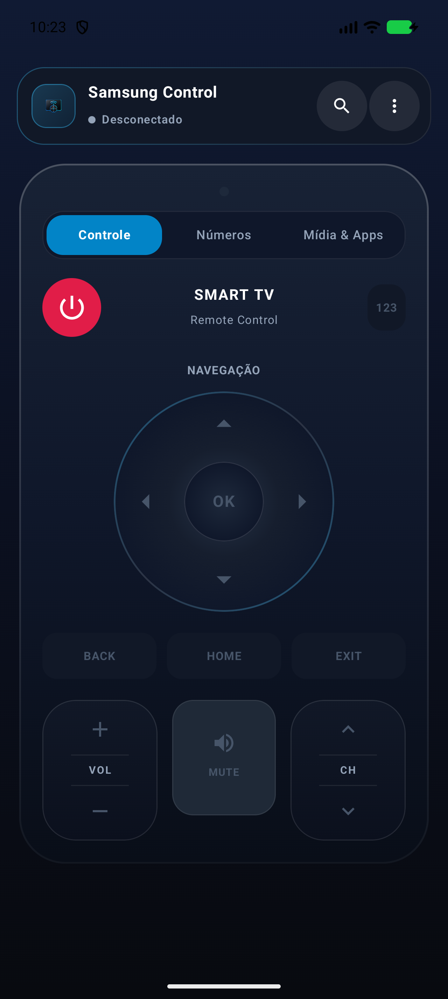
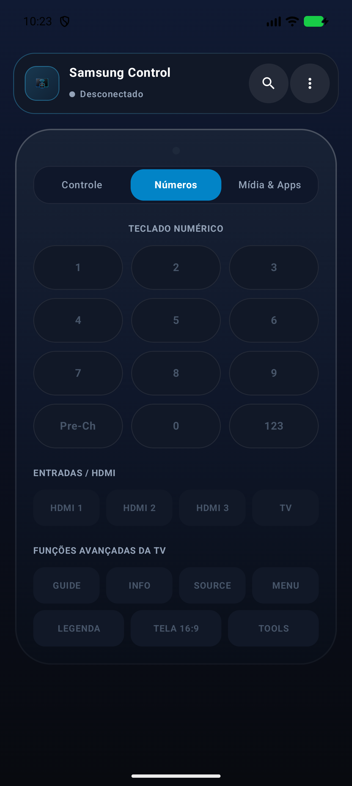
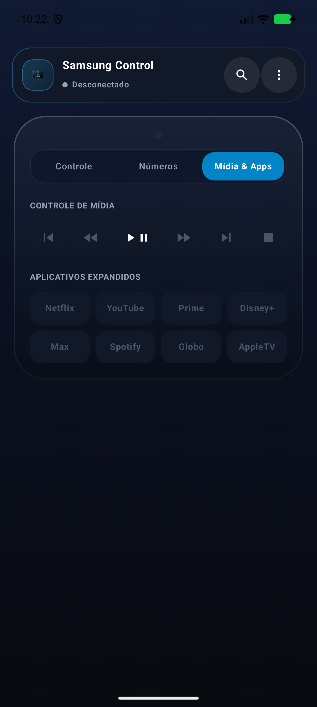

# SamsungControll

SamsungControll é um controle remoto Android local-first para TVs Samsung. O app descobre TVs na rede local, conecta via WebSocket e envia comandos de controle remoto sem depender de Samsung Account ou integração com SmartThings.

## Objetivo

O projeto busca ser um controle simples, direto e privado para uso na rede local:

- Sem login Samsung.
- Sem cloud própria.
- Sem analytics.
- Sem automações frágeis dependentes do estado interno de apps de streaming.
- Com persistência segura de tokens e pareamento local com a TV.
- Respeitando o padrão **SOLID** de arquitetura de software e injeção de dependências.

## Funcionalidades

- **Navegação por Abas Segmentadas (`TabRow`)**:
  - **Aba 1: Controle Principal**: D-Pad neomórfico, Volume, Canais, Power, Mute, Navegação (`BACK`, `HOME`, `EXIT`) e tecla rápida `123`.
  - **Aba 2: Números & Guia**: Teclado numérico 0-9 em grade 3x4 (`1-9`, `Pre-Ch`, `0`, `123`), atalhos diretos de entrada (`HDMI 1`, `HDMI 2`, `HDMI 3`, `TV`) e teclas de função (`GUIDE`, `INFO`, `SOURCE`, `MENU`, `LEGENDA`, `TELA 16:9`, `TOOLS`).
  - **Aba 3: Mídia & Apps**: Botões de reprodução (`Play/Pause`, `Avançar ⏩`, `Retroceder ⏪`, `Anterior ⏮️`, `Próximo ⏭️`, `Parar ⏹️`) e 8 atalhos para apps (`Netflix`, `YouTube`, `Prime Video`, `Disney+`, `Max`, `Spotify`, `Globoplay`, `Apple TV`).
- **Informações Detalhadas da TV (REST API)**:
  - Consulta automática no endpoint REST local `http://IP:8001/api/v2/`.
  - Exibe no menu: Modelo da TV, Sistema Operacional (Tizen), Firmware, Tipo de Conexão (Wi-Fi/Ethernet), IP e MAC.
- **Busca & Apelidos de TV**:
  - Busca de TVs Samsung na rede local via SSDP/UPnP com filtragem estrita.
  - Entrada manual de IP com botão dedicado.
  - Apelidos personalizados criptografados no dispositivo (*TV da Sala*, *TV do Quarto*).
- **Wake-on-LAN & Reconexão**:
  - Envio de magic packets para acordar a TV desligada antes de reconectar.
- **UI Premium & Haptics**:
  - Feedback tátil (vibração hática) configurável via `HapticsManager`.
  - Animações sutis de compressão com mola física (`pressScale`).
  - Emissor LED virtual com brilho dinâmico ao transmitir comandos.

## Capturas de Tela

| Controle Principal | Números & Guia | Mídia & Apps |
|:---:|:---:|:---:|
|  |  |  |

## Stack

- Kotlin.
- Android SDK 37.
- Jetpack Compose com Material 3.
- Injeção de Dependências com **Koin 3.5.6**.
- AndroidX Lifecycle ViewModel.
- OkHttp para HTTP/WebSocket.
- Gradle Kotlin DSL.

## Arquitetura & SOLID

Principais classes e abstrações:

- `SamsungControlApplication`: ponto de inicialização da Application e container do Koin.
- `di/AppModule`: módulo Koin para injeção desacoplada de dependências.
- `MainActivity`: host do Compose e injeção do `RemoteViewModel` via `koinViewModel()`.
- `RemoteControlScreen`: tela principal com abas segmentadas e diálogo de detalhes da TV.
- `RemoteViewModel`: estado de UI, descoberta, conexão, apelidos e ações do controle.
- `TvConnectionException`: hierarquia selada de exceções (`NetworkUnreachable`, `PermissionDenied`, `DeviceNotFound`, `CertificateMismatch`).
- `SamsungDeviceInfoResolver`: leitor REST da API local `/api/v2/` para extração de modelo, OS e firmware.
- `HapticsManager`: interface desacoplada para feedback tátil (`AndroidHapticsManager` e `NoOpHapticsManager`).
- `PressAnimation`: modificador reutilizável `Modifier.pressScale` baseado em molas físicas do Compose.
- `TvController` & `SamsungTvController`: contrato e implementação do controle remoto WebSocket.
- `DiscoveryService` & `TvDiscovery`: contrato e implementação de descoberta SSDP/UPnP.
- `WakeOnLanSender`: envio de magic packets UDP.
- `SecureTvPreferences`: persistência segura de IP, apelidos, tokens e certificados TOFU.

## Segurança

- Só permite conexão com IPs/hosts de rede local.
- Armazena tokens com Android Keystore.
- Associa tokens, apelidos e MACs por identidade SSDP e por IP.
- Pinagem TOFU do certificado SSL/TLS da TV.

## Requisitos

- Android Studio recente.
- JDK compatível com o Gradle configurado.
- Android SDK 37.1 instalado.
- Dispositivo Android conectado na mesma rede local da TV.

## Como Rodar e Testar

Via terminal:

```bash
./gradlew test
./gradlew lint
./gradlew assembleDebug
```

Para executar a suíte de testes de UI do Compose:

```bash
./gradlew connectedCheck
```

Para gerar o pacote de Release (APK / AAB otimizado):

```bash
./gradlew assembleRelease
```

## Licença

Distribuído sob a licença MIT. Veja [LICENSE](LICENSE).
